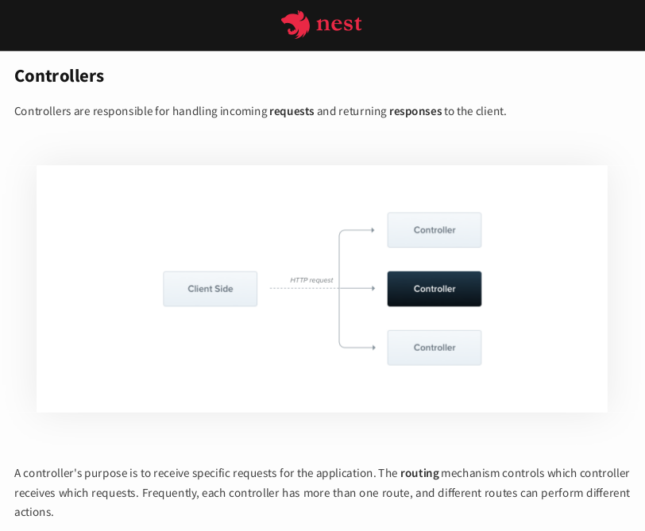

# docs.nestjs.com-pdf

Downloads docs.nestjs.com documentation pages as PDF.
You can find the pages in the [pdf](https://github.com/BrunnerLivio/docs.nestjs.com-pdf/tree/master/pdf) folder.



## Usage

In order to run the script yourself you must need Node 8.x.x and an internet connection.

```

git clone https://github.com/BrunnerLivio/docs.nestjs.com-pdf.git
cd docs.nestjs.com-pdf
yarn # or npm install
yarn run start

```
